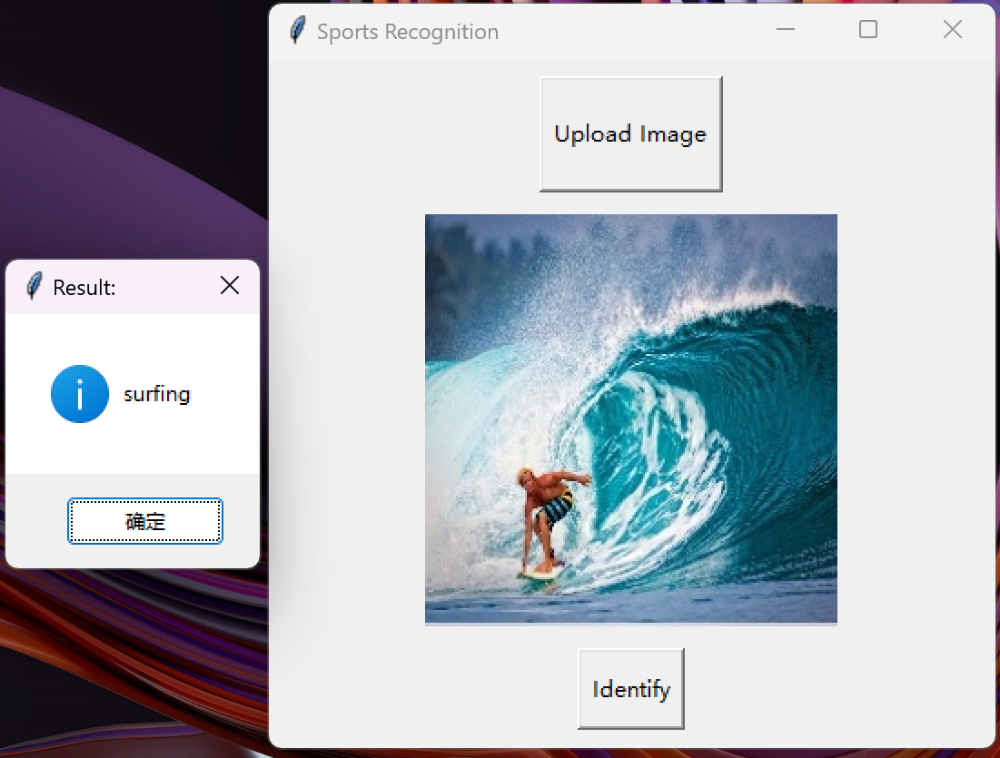
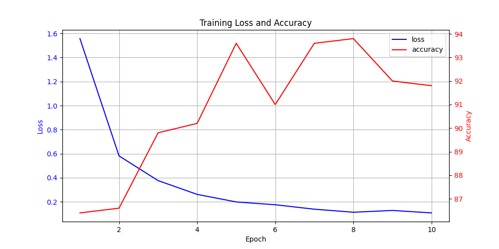

# ResNet50 Sports Recognition System

English / [中文](readme_zh.md)

↑ 点击切换语言

This project is based on ResNet50 for transfer learning. By freezing some layers, it trains on 13,000 images covering 100 different sports activities, constructing a model with an accuracy of over 90%. Additionally, a simple GUI interface based on Tkinter has been developed. As shown in the image below, it allows custom image uploads and provides the prediction result through a popup window.



To evaluate the model's performance during training, this project records the changes in loss and accuracy throughout the training process and plots them as graphs. The following image shows the changes over 10 epochs, illustrating the trends in training loss and accuracy.



## Table of Contents

- [Multilingual Comments](#multilingual-comments)
- [Dataset](#dataset)
- [File Structure](#file-structure)
- [Notice](#notice)
- [Contribution](#contribution)

## Multilingual Comments

To make it easier for developers from different language backgrounds to understand the code, comments in this project are provided in both English and Chinese.

## Dataset

The dataset used in this project is sourced from [Kaggle](https://www.kaggle.com/datasets/gpiosenka/sports-classification).
Please download the dataset directly from the provided link and place it in the data folder.


## File Structure

The project's file structure is as follows:

```c++
Sports_Recognition
│
├── data/
│   ├── test
│   ├── train
│   └── valid
│
├── model/
│   ├── model.pt
│   ├── training.log
│   └── training_metrics.csv
│    
│
├── utils(en/zh)/
│   ├── __init__.py
│   ├── data_loader.py
│   ├── ResNet.py
│   ├── train.py
│   ├── predict.py
│   ├── metrics.ipynb
│   └── GUI.py
│
└── main.py 
```

## Notice

Due to GitHub's file size limit of 25MB, I am unable to upload the dataset and model files directly to this repository. As a result, only the code is available here and I apologize for it.

## Contribution

All forms of contributions are welcome! Whether it's reporting bugs or suggesting new features, Thank you so much!!!
