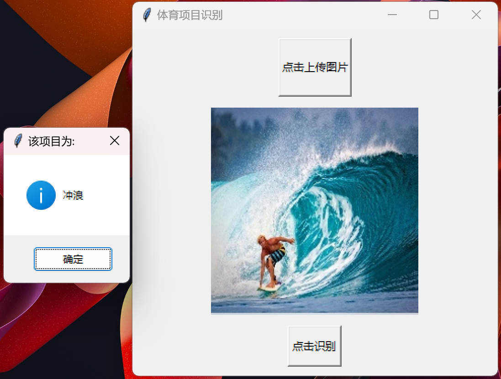

# ResNet50 体育项目识别

[English](readme_zh)  /  中文

↑ Click to switch language

本项目基于 ResNet50 进行迁移学习 通过冻结部分层数 对 13000 张涵盖 100 种不同体育项目的图片进行训练 构建了一个准确率超过 90% 的模型 并且开发一个基于 Tkinter 的简单 GUI 界面 如下图所示 可以实现自定义图片上传 并通过弹窗得到判断的结果 



为了评估模型在训练过程中的表现 本项目记录了训练过程中的损失值（Loss）和准确率（Accuracy）的变化情况 并将其绘制成图表 以下图像展示了训练 10 个 Epoch 的变化情况 模型的损失值和准确率的变化趋势


## 目录

- [多语言注释](#多语言注释)
- [数据集](#数据集)
- [文件结构](#文件结构)
- [注意事项](#注意事项)
- [贡献](#贡献)

## 多语言注释

为了让不同语言背景的开发者更容易理解代码 本项目的注释提供了英文和中文两种版本

## 数据集

本项目使用的数据集来源于 [Kaggle](https://www.kaggle.com/datasets/gpiosenka/sports-classification)
请直接从提供的链接下载数据集 并将其放置在 data 文件夹中

## 文件结构

项目的文件结构如下

```c++
Sports_Recognition
│
├── data/
│   ├── test
│   ├── train
│   └── valid
│
├── model/
│   ├── model.pt
│   ├── training.log
│   └── training_metrics.csv
│    
│
├── utils(en/zh)/
│   ├── __init__.py
│   ├── data_loader.py
│   ├── ResNet.py
│   ├── train.py
│   ├── predict.py
│   ├── metrics.ipynb
│   └── GUI.py
│
└── main.py 
```

## 注意事项

因为 GitHub 的文件上传最大为 25MB 所以我无法将处理后的数据集和模型上传到该项目 所以这里仅提供代码和思路 抱歉

## 贡献

欢迎所有形式的贡献！无论是报告错误还是提出建议 非常感谢！！